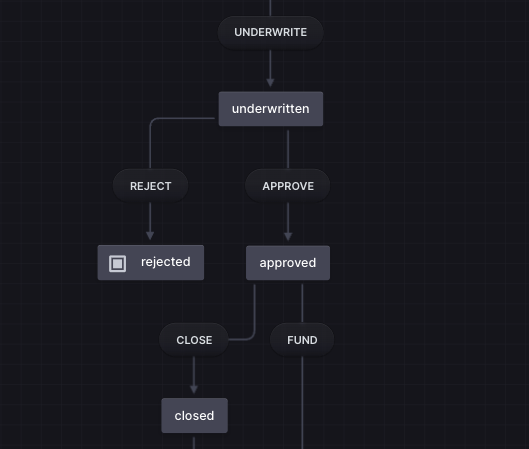

# Product Architecture
Product Architecture is where business intent becomes a system, before it becomes software. It is the discipline of defining a product's structure, behavior, and constraints so it can be intentionally designed, consistently delivered, and safely evolved as a system.

## Table of Contents

- [Key Concepts](#key-concepts)
  - [Structure](#structure)
  - [Operations](#operations)
  - [Behavior](#behavior)
    - [States and Transitions](#states-and-transitions)
  - [Constraints](#constraints)

## Key Concepts

### Structure

The building blocks of a product, how they're organized, and how they relate to each other. Structure is a simple concept with a profound impact, relating to:

- **Modular Structure** - Organizing the product into discrete, cohesive modules
- **Clear Dependencies** - Defining explicit relationships between components
- **Business Alignment** - Ensuring the architecture reflects business domains and objectives
- **Simple Product & Knowledge Management** - Making the system understandable and maintainable
- **Operations & Controls** - Defining the operational capabilities layered into system behaviors, including access controls, feature flags, audit logs, and other cross-cutting concerns that govern how operations execute

**Example:** Loan Origination System Structure

Structure is hierarchical, organizing from the organizational level down to individual components:

```
Loander (Organization)
└── Loan Origination (Domain)
    └── Loan Application (Module)
        └── Borrower Info (Page, Step 1)
            └── Borrower Info Form Container (Section)
                ├── Borrower Info Form Title (Block)
                └── Borrower Info Form (Block)
```

This hierarchy shows how:
- **Organization** defines the top-level business entity
- **Domain** represents a major business capability (e.g., Loan Origination vs. Loan Servicing)
- **Module** groups related functionality within a domain
- **Page** represents a user-facing interface or workflow step
- **Section** organizes content within a page
- **Block** is an individual component or UI element

**Note:** What matters is a hierarchical definition and boundaries, not specifically the terms used at each hierarchical level. 

### Operations

Operations bridge the gap between what the system *is* (Structure) and what it *does* (Behavior). They are:
- **Scoped by Structure** - Operations belong to specific domains, modules, and contexts within the structural hierarchy, enforcing boundaries and ownership
- **Express Behavior** - Operations define the actions and state transitions that drive the system's lifecycle and workflows
- **Enable Controls** - Operations serve as the attachment point for cross-cutting concerns like permissions, feature flags, audit logs, and business rules
- **Create Vocabulary** - Operations establish a shared language between business stakeholders and technical teams

By organizing operations within the structural hierarchy using the pattern `[domain]:[resource]:[action]`, we create a clear mapping between business capabilities (structure) and business processes (behavior).

**Example:** The lifecycle of a Loan

**Loan Origination** - Creating and approving new loans:
- `loan-origination:loan:draft` - Initial creation and data gathering
- `loan-origination:loan:submit` - Customer submits application for review
- `loan-origination:loan:verify` - Document and information verification
- `loan-origination:loan:underwrite` - Risk assessment and approval process
- `loan-origination:loan:approve` - Loan is approved for funding
- `loan-origination:loan:reject` - Loan is declined (terminal state)
- `loan-origination:loan:close` - Finalization, signing, and activation

**Loan Servicing** - Managing active loans:
- `loan-servicing:loan:fund` - Disbursement of loan proceeds
- `loan-servicing:loan:service` - Active loan in repayment phase
- `loan-servicing:loan:modify` - Terms are renegotiated or adjusted
- `loan-servicing:loan:default` - Payment obligations not met
- `loan-servicing:loan:payoff` - Loan is fully repaid (terminal state)
- `loan-servicing:loan:charge-off` - Loan written off as loss (terminal state)

### Behavior

Interactions within the system that describe how the system behaves. This involves the flow of operations and state transitions throughout the product lifecycle.

#### States and Transitions

States represent the condition of a resource at a point in time, while transitions define how resources move from one state to another. States and transitions are intrinsically linked to Operations:

- **Operations trigger transitions** - When an operation executes, it moves a resource from one state to another
- **Completed operations yield states** - A successful operation produces a new state, represented as a resource with a past-tense action (e.g., `loan:submitted`, `loan:approved`, `loan:funded`)
- **States enable or restrict operations** - The current state determines which operations are valid (e.g., you can't `loan:fund` until the loan is in the `loan:approved` state)
- **Transitions create history** - Each state transition forms an audit trail of how the resource evolved over time

**Example:** Loan State Transitions



### Constraints

*(To be defined)*